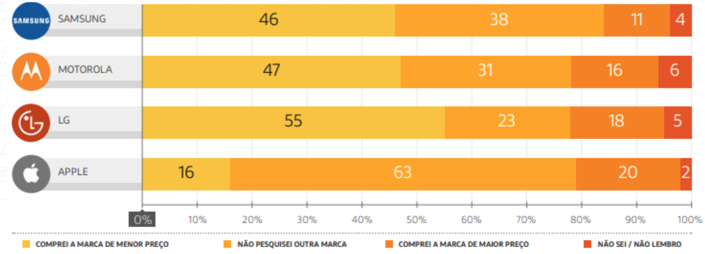

# Market Analysis for Brazilian-Spanish Collaboration

## Overview

This project analyzes the feasibility of a Brazilian company's expansion into the Spanish market. Using data from both markets, we perform a comprehensive SQL-based analysis to identify key opportunities and challenges.

## Objective

To evaluate the potential for successful collaboration between a Brazilian company and a partner in the Spanish market, leveraging SQL queries and data analysis techniques.

## Data Source

The data for this analysis was sourced from [Source Name], covering market trends, consumer behavior, and economic indicators in both Brazil and Spain.

## Tools Used

- MySQL Workbench
- Tableau

## Folder Structure

- `/src`: Contains all SQL scripts and code.
- `/data`: Exported data from MySQL Workbench to create Tableau plots.
- `/docs`: Project documentation, reports and presentation.
- `/images`: Images and diagrams used in documentation.

## Analysis Summary

Our comprehensive market analysis has revealed several key insights regarding the potential collaboration between Eniac and Brazilian markets. The findings suggest that while Brazil could present a viable market for Eniac, there are significant considerations to address:

1. **Scale Limitations of Magist**: Our data indicates that Magist, the potential local partner, does not currently operate at a scale that meets Eniac's requirements. This mismatch could pose challenges in meeting production and distribution demands.

2. **Delivery and Efficiency Concerns**: Analysis of Magist's operational data shows that their delivery timelines do not align with the high standards expected by Eniac. This discrepancy could impact customer satisfaction and brand reputation.

3. **Experience with High-End Products**: Magist has limited experience in dealing with expensive, high-end products and their consumers. This gap in expertise might lead to challenges in market penetration and customer retention.

Given these findings, we recommend a cautious approach. It would be prudent to pause any immediate plans for entering the Brazilian market with Magist. Further exploration and analysis are needed to identify suitable strategies or alternative partnerships that align better with Eniac's business objectives and standards.

# Other findings

## Adding an image

## Authors

- [Joan Claverol](https://github.com/JoanClaverol)
- [Hana Lacic](https://github.com/hanaamulic)

## License

### Types of licenses

1. MIT License
   - Why Use It: It's simple and permissive. This license allows users to do almost anything they want with your project, like using, copying, modifying, merging, publishing, distributing, sublicensing, and/or selling copies.
   - Ideal For: Projects where you want to allow maximum freedom for others to use or build upon.
2. GNU General Public License (GPL)
   - Why Use It: It's a copyleft license, meaning any derivative work must be open-sourced under the GPL as well.
   - Ideal For: Projects where you want to ensure that all modifications and extensions remain open source.
3. Apache License 2.0
   - Why Use It: Similar to the MIT License but also provides an express grant of patent rights from contributors to users.
   - Ideal For: Projects where you want to provide some protection against patent litigation.
4. Creative Commons Licenses
   - Why Use It: If your project is more documentation or content-focused (like datasets or educational content).
   - Variations: Ranging from very permissive (CC BY) to more restrictive (CC BY-NC-ND).
   - Ideal For: Projects where you want to specify conditions for attribution, commercial use, or derivative works.
5. No License
   - Implication: Others cannot reproduce, distribute, or create derivative works from your work.
   - Ideal For: If you want to retain all rights but still share your work publicly for viewing.

## Example of how to add a Licence to your project

This work is licensed under a Creative Commons Attribution-NoDerivatives.
